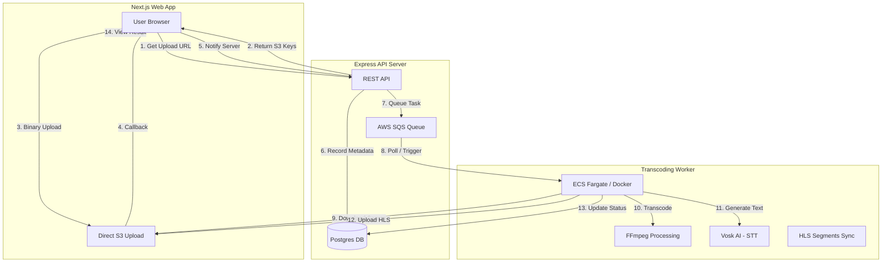

# System Architecture (Video Transcoding)

This document provides a high-level overview of the event-driven video transcoding 
architecture and its underlying components.

---

## 🏗️ High-Level Technical Overview

The system is designed to handle high-volume video processing through an 
asynchronous, scalable pipeline. It decouples media ingestion from the heavy 
compute work of transcoding, allowing for optimal resource utilization.

---

## 🔬 Component Breakdown

### 1. Frontend (Next.js)
- **Role**: Entry point for users to upload and watch videos.
- **Key Features**:
    - Optimistic UI updates during the upload phase.
    - Custom HLS Player supporting adaptive bitrate and subtitles.
    - Direct-to-S3 uploads using pre-signed URLs to reduce server load.
- **Tech**: Next.js, Tailwind CSS, Hls.js, Lucide Icons.

### 2. Backend (Express API)
- **Role**: The orchestrator of the system.
- **Key Responsibilities**:
    - Generating secure, time-limited S3 pre-signed URLs for uploads.
    - Managing video metadata in PostgreSQL.
    - Dispatching transcoding jobs to the AWS SQS queue.
    - Tracking the state of active containers and ECS tasks.
- **Tech**: Express.js, TypeScript, AWS SDK, PostgreSQL (Neon).

### 3. Transcoding Worker (Bun + FFmpeg)
- **Role**: The compute-intensive engine that performs the actual processing.
- **Lifecycle**:
    1.  **Ingestion**: Downloads the raw video from S3.
    2.  **Transcoding**: FFmpeg generates multiple HLS segments and an adaptive 
        master playlist.
    3.  **AI Analysis**: Vosk AI generates a transcript and WebVTT subtitles.
    4.  **Synchronization**: Uploads the processed segments, thumbnails, and 
        subtitles back to S3.
- **Tech**: Bun, FFmpeg, Python (Vosk), AWS SDK.

---

## 📡 Event Flow

1.  **Presigning**: The client requests an upload path. The server generates 
    a unique S3 key and a temporary signed URL.
2.  **Streaming**: The client streams the video directly to S3.
3.  **Queuing**: Once the upload is confirmed, the server creates a `QUEUED` 
    record in the DB and signals SQS.
4.  **Processing**: A worker (either local Docker or AWS ECS Fargate) picks up 
    the message, transitions the DB record to `PROCESSING`, and starts FFmpeg.
5.  **Completion**: On success, the status is set to `COMPLETED` and the S3 
    folder is purged of temporary artifacts.

---

## 🔒 Security

- **IAM Isolation**: Workers use specific task roles with limited S3 and 
  CloudWatch permissions.
- **Pre-signed URLs**: All uploads are authenticated via signatures valid for 
  only 60 minutes.
- **Public Privacy**: Only processed HLS segments are publicly readable via 
  S3 bucket policies.
