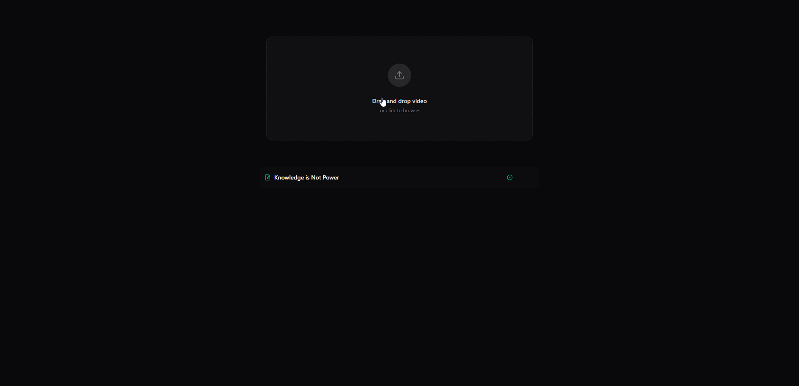
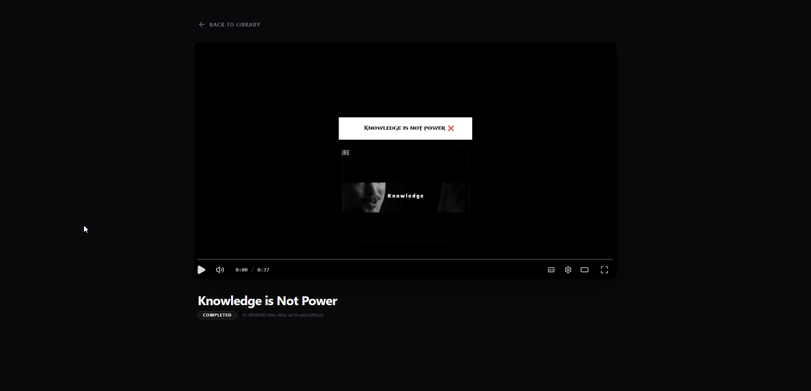

# Video Transcoding System Architecture 🚀

A high-fidelity, event-driven video transcoding system built with Next.js, 
Express, and AWS Fargate. It handles the entire lifecycle of a video—from 
direct S3 uploads and adaptive bitrate transcoding to AI-driven subtitle 
generation and public playback.






---

## 🏗️ Core Architecture

This project is a monorepo consisting of three highly decoupled components, 
linked through AWS infrastructure:

| Component | Description | Tech Stack |
| :--- | :--- | :--- |
| **[Web](./web)** | Next.js Frontend | Next.js, Tailwind, Hls.js, Radix UI |
| **[Server](./server)** | Node.js Orchestrator | Express, AWS SDK, PostgreSQL |
| **[Worker](./transcoding-container)** | Compute Engine | Bun, FFmpeg, Vosk AI, Python |

For a deep-dive into the event-driven system flow and Mermaid diagrams, 
see the **[Architecture Documentation](./ARCHITECTURE.md)**.

---

## 🚀 Quick Start Guide

### 1. Requirements
Ensure you have the following installed on your machine:
- [Bun](https://bun.sh/) (Primary runtime)
- [Docker](https://www.docker.com/) (For local worker execution)
- [PostgreSQL](https://www.postgresql.org/)

### 2. Clone and Setup
Clone the repository and install dependencies:
```bash
git clone https://github.com/lwshakib/video-transcoding-system-architecture.git
cd video-transcoding-system-architecture
bun install
```

### 3. Infrastructure Setup
The system requires an active AWS environment (S3, SQS, ECS, ECR). 
Follow the **[AWS Configuration Guide](./AWS_CONFIGURATION.md)** to 
provision your cloud resources either manually or via automated scripts.

### 4. Local Development
To run all services locally:
```bash
# In separate terminal windows
cd server && bun run dev
cd web    && bun run dev
```

---

## 🛠️ Key Features

- **Direct-to-S3 Uploads**: Secure pre-signed URLs to offload heavy binary 
  traffic from the main API.
- **Adaptive Bitrate Streaming**: FFmpeg generates HLS (Apple HTTP Live 
  Streaming) playlists and segments.
- **AI-Driven Transcription**: Integrates Vosk to generate high-fidelity 
  subtitles automatically.
- **Scalable Workers**: Jobs are queued in AWS SQS and processed by 
  transient AWS ECS Fargate tasks.
- **High-Fidelity UI**: Interactive dashboard with real-time upload progress 
  and a custom video player.

---

## 🤝 Contributing & Community

We welcome contributions of all kinds! Please read our 
**[Contributing Guide](./CONTRIBUTING.md)** to get started with the 
development workflow.

By participating, you agree to follow our 
**[Code of Conduct](./CODE_OF_CONDUCT.md)**.

---

## 🛡️ License

This project is licensed under the MIT License - see the [LICENSE](LICENSE) 
file for details.